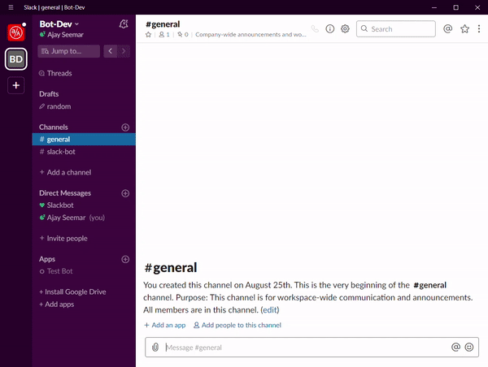

# SlackBot - American Express Coding Challenge
Slack Bot app that can be used with a slash command to send pictures embedded in websites

To test the command live in action, join the workspace bot-devorg. I believe new members should be accepted instantly

To set up project directory extract repo to desired folder and open in command line:
1. Create a new python virtual environment with the command 'virtualenv env' and activate by running 'env/scripts/activate'
    - If virtualenv is not installed run 'pip install virtualenv'
2. Install all project dependencies with 'pip install -r requirements.txt'
3. To start local server, just run 'python app.py' in command line

Current Bugs:
- Can not retrieve pictures from Google Image search results due to the way the src url is linked
